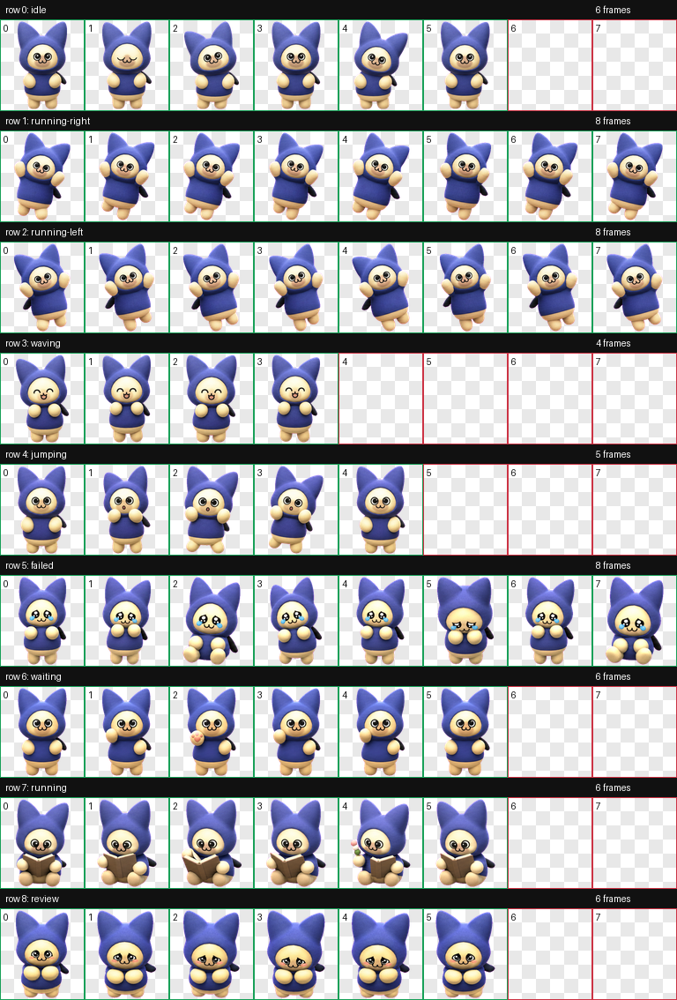

# 呆猫

一个 Codex 桌面宠物包，角色是圆滚滚、软乎乎、呆萌表情的蓝紫色猫耳头套小伙伴。

## 文件

- `pet.json`: Codex 自定义桌宠清单。
- `spritesheet.webp`: 透明背景动画图集，尺寸为 `1536x1872`。
- `docs/contact-sheet.png`: 动作表预览。
- `docs/validation.json`: hatch-pet 图集校验结果。

## 预览



## 安装

把整个 `daimao` 文件夹放到：

```text
%USERPROFILE%\.codex\pets\daimao
```

目录结构应为：

```text
daimao/
  pet.json
  spritesheet.webp
```

## 动画状态

图集遵循 Codex 桌宠固定格式：`8` 列、`9` 行，每格 `192x208`。

| 行 | 状态 | 语义 |
| --- | --- | --- |
| 0 | idle | 发呆、呼吸、眨眼 |
| 1 | running-right | 被向右拖动 |
| 2 | running-left | 被向左拖动 |
| 3 | waving | happy，开心轻弹 |
| 4 | jumping | surprised，被点击后惊讶 |
| 5 | failed | cry，委屈哭哭 |
| 6 | waiting | clicked，指你喵反应 |
| 7 | running | study，看小狩猎指南 |
| 8 | review | shy，害羞抱肚子 |

## 校验

- 图集格式：WebP / RGBA
- 图集尺寸：`1536x1872`
- 单元格：`192x208`
- 透明像素 RGB 残留：`0`
- hatch-pet frame inspection：无错误、无警告

## 说明

此包只包含桌宠运行所需文件，没有游戏 UI、Logo、水印或背景。参考形象来自用户提供的游戏截图，并重新制作为适合桌面陪伴用途的原创风格化桌宠图集。
